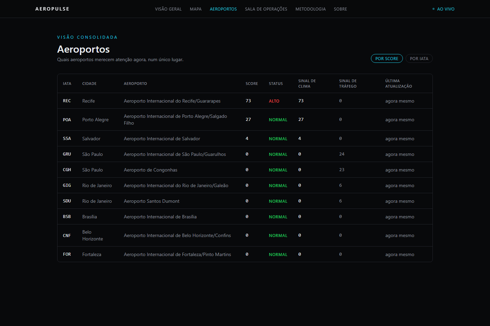

# AeroPulse

**Experimental Aviation Intelligence Platform** — cross-references live weather, observed air
traffic, and historical trends for 10 major Brazilian airports into a transparent, explainable
signal.

🔗 **Live:** [aeropulse-eight.vercel.app](https://aeropulse-eight.vercel.app)


## Overview

Aviation dashboards either show raw data (a wall of numbers nobody outside the industry can read)
or make confident-sounding predictions with no visible reasoning. Neither builds trust: the first
is unusable, the second is dishonest about how much a hobby project running on free APIs can
actually know.

AeroPulse cross-references independent, real data sources — weather, observed air traffic, and
historical trend — into a single 0–100 **AeroPulse Score** per airport, and always shows *why* the
score is what it is, not just the number. It's explicit about what's live, what's a 30-minute
snapshot, and what's not available at all, instead of blending everything into one undifferentiated
"live" badge — an unavailable reading is never shown as zero.

**What AeroPulse is not:** it does not predict flight delays, cancellations, or real airline
operations, and it never will. See [Limitations](#limitations).

## Features

- **Home** — map of Brazil with all 10 monitored airports, a consolidated system-status panel, and
  a slide-over airport summary.
- **Map** — dedicated geographic exploration view with status filters, separate from the
  operational War Room.
- **Airports** — a sortable consolidated table: score, status, weather signal, traffic signal, and
  last update per airport, built to answer "which airport needs attention right now."
- **Airport detail** — full score breakdown, real 24h trend history, live weather and traffic, and
  an AI-generated plain-language explanation of the current signal.
- **War Room** — fullscreen operational view for monitoring every airport at once.
- **Methodology** — full transparency on what feeds the score, what doesn't yet, and why.
- Explicit, honest data states everywhere: live vs. stale vs. mock vs. unavailable — never guessed,
  never faked.

## Screenshots

| Airport detail — score breakdown, AI explanation, real history | War Room — fullscreen ops view |
|---|---|
|  |  |



## Architecture

```
Open-Meteo  ─┐                                    ┌─ Browser (React)
OpenSky      ├─ Data Layer (services/) ─ Score ──►│    Home · Map · Airports · War Room
Supabase     │        engine (score/)   Engine     │    Airport Detail
Gemini      ─┘                                    └─ AI Explain Signal
```

- **Weather** — fetched directly from the browser (Open-Meteo allows it; no key needed).
- **Air traffic & history** — OpenSky blocks direct browser calls (CORS) and, empirically, stalls
  past serverless function time limits when called from cloud IP ranges. A GitHub Actions job
  captures weather + traffic + score for every airport every 30 minutes into Supabase; the site
  reads the latest snapshot instead of calling OpenSky live. An airport missing from that snapshot
  is served as "unavailable", never as zero aircraft.
- **AI explanation** — a Vercel Function forwards the *already-computed* score/drivers/weather to
  Gemini and returns 2–4 sentences of plain-language explanation in Portuguese. The model is
  instructed to explain only the given data — never invent a driver, never predict operations, and
  never treat a missing traffic reading as zero.
- No traditional backend/database server — just a static React app, two small serverless functions,
  a Postgres table (Supabase), and a scheduled GitHub Action.

## Data sources

| Source | Used for | Notes |
|---|---|---|
| [Open-Meteo](https://open-meteo.com) | Rain, wind, visibility, temperature | Free, no key, CC-BY 4.0 |
| [OpenSky Network](https://opensky-network.org) | Observed aircraft near each airport | Free, anonymous access, 400 credits/day |
| [OpenFreeMap](https://openfreemap.org) | Map tiles | Free, no key; dark style authored by hand (OpenFreeMap ships light styles only) |
| [Google Gemini](https://ai.google.dev) | Natural-language signal explanation | Free tier, no card |
| [Supabase](https://supabase.com) | Score/weather/traffic history | Free tier, no card |

## AeroPulse Score

The score is **weather-only in v1** — in effect, a Weather Signal: rain chance (up to 40 pts), wind
speed above 20 km/h (up to 35 pts), and visibility (0/15/35 pts), capped contributions so no single
factor dominates, and every score is shown with the specific factors ("drivers") that produced it.

Observed air traffic is displayed as its own signal but deliberately excluded from the score: a raw
aircraft count is meaningless without a per-airport historical baseline (Guarulhos is busy on an
ordinary day in a way Santos Dumont never is), and that baseline needs history the project is only
now accumulating. A reserved Event Signal slot exists in the UI for the same reason — the
architecture doesn't assume the score will stay weather-only forever, but nothing is computed until
there's real data behind it. Both show "N/D" rather than a guess. Full writeup, including status
bands, lives on the site's `/methodology` page.

## Tech stack

Vite · React · TypeScript · Tailwind CSS v4 · MapLibre GL JS · Recharts · Supabase · GitHub Actions
· Vercel Functions · Google Gemini API

Chosen by problem, not by popularity — see the data sources table above for why each one is there.

## Monitored airports

GRU · CGH · GIG · SDU · BSB · CNF · REC · SSA · FOR · POA — São Paulo, Rio de Janeiro, Brasília,
Belo Horizonte, Recife, Salvador, Fortaleza, and Porto Alegre.

## Running locally

```bash
npm install
npm run dev
```

Copy `.env.example` to `.env.local` and fill in a Supabase project's keys to enable score history
and the AI explanation (a Google AI Studio key). The app works without them — weather stays live via
Open-Meteo either way, and unconfigured features fall back to a clearly-labeled mock instead of
breaking.

## Environment variables

See [`.env.example`](.env.example) for the full list with explanations. Summary:

| Variable | Required for | Safe to expose? |
|---|---|---|
| `VITE_SUPABASE_URL` / `VITE_SUPABASE_ANON_KEY` | Reading score history in the browser | Yes — read-only, RLS-restricted |
| `SUPABASE_URL` / `SUPABASE_SERVICE_ROLE_KEY` | Writing snapshots (GitHub Actions only) | **No** — server/CI only, never in the browser |
| `GEMINI_API_KEY` | The "Explain this signal" feature | **No** — server-side only (dev proxy / Vercel Function) |

## Limitations

- The AeroPulse Score is an experimental heuristic built for this project, not a validated aviation
  model. It does not predict delays, cancellations, or real operations, and does not substitute
  official sources (airlines, airport operators, aviation authorities).
- It does not evaluate an airport's operation as a whole — today it's essentially a weather signal.
- Air traffic is a count of aircraft within 50km of an airport, not verified arrivals/departures,
  and isn't available for every airport at every moment — when it isn't, the UI says so explicitly
  instead of showing zero.
- History only goes back to when the GitHub Action started running, persists in Postgres
  indefinitely (unaffected by page refreshes or new deploys), and isn't reconstructed after the
  fact — an airport without at least two captured points shows a clearly-labeled illustrative
  example instead of a real trend.
- Coverage of every data source can vary; free-tier rate limits apply.

## Roadmap

v1 is closed. What's deliberately still open for a possible v2, not promised:

- Folding traffic into the score once enough history exists to define a real per-airport baseline.
- A real Event Signal, if a data source with an acceptable signal-to-noise ratio turns up (GDELT was
  evaluated for this and rejected — too noisy to attribute reliably to a specific airport).

## Disclaimer

AeroPulse is an experimental, personal portfolio project. Every score is a signal computed by this
app from public data — not an official aviation indicator, not a forecast, and not affiliated with
any airline, airport operator, or aviation authority. Don't make real travel decisions based on it.
