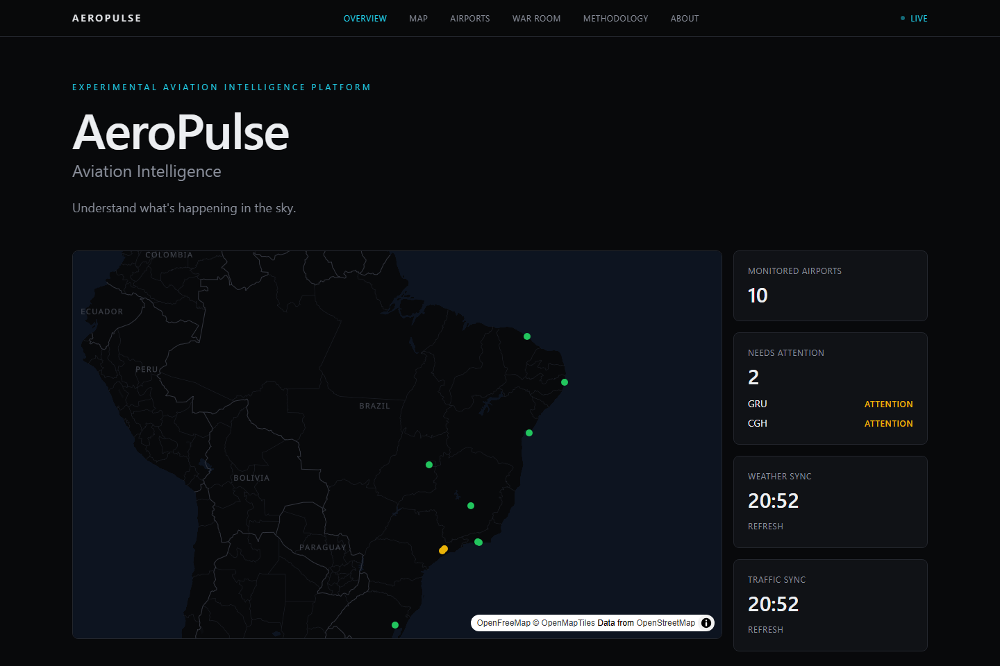
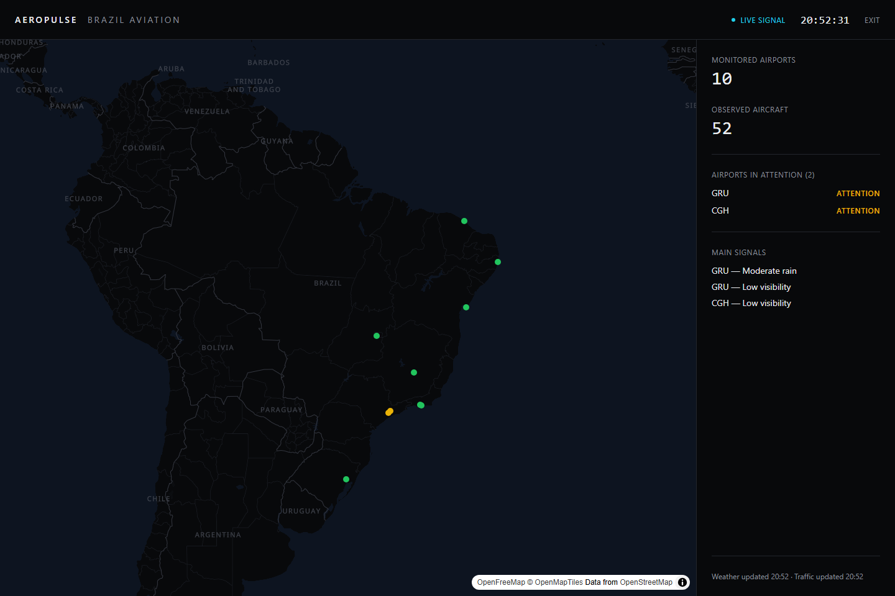

# AeroPulse

**Experimental Aviation Intelligence Platform** — cross-references live weather, observed air
traffic, and historical trends for major Brazilian airports into a transparent, explainable signal.

🔗 **Live:** [aeropulse-eight.vercel.app](https://aeropulse-eight.vercel.app)



## The problem

Aviation dashboards either show raw data (a wall of numbers nobody outside the industry can read)
or make confident-sounding predictions with no visible reasoning. Neither builds trust: the first
is unusable, the second is dishonest about how much a hobby project running on free APIs can
actually know.

## The proposal

AeroPulse cross-references three independent, real data sources — weather, observed air traffic,
and historical trend — into a single 0–100 **AeroPulse Score** per airport, and always shows *why*
the score is what it is, not just the number. It is explicit about what's real-time, what's a
30-minute snapshot, and what's still a placeholder, instead of blending everything into one
undifferentiated "live" badge.

**What AeroPulse is not:** it does not predict flight delays, cancellations, or real airline
operations, and it never will. See [Disclaimer](#disclaimer).

## Screenshots

| Airport detail — score, drivers, AI explanation, real history | War Room — fullscreen ops view |
|---|---|
|  |  |

## Architecture

```
Open-Meteo  ─┐                                    ┌─ Browser (React)
OpenSky      ├─ Data Layer (services/) ─ Score ──►│    Home · Map · War Room
Supabase     │        engine (score/)   Engine     │    Airport Detail
Gemini      ─┘                                    └─ AI Explain Signal
```

- **Weather** — fetched directly from the browser (Open-Meteo allows it; no key needed).
- **Air traffic & history** — OpenSky blocks direct browser calls (CORS) and, empirically, stalls
  past serverless function time limits when called from cloud IP ranges. A GitHub Actions job
  captures weather + traffic + score for every airport every 30 minutes into Supabase; the site
  reads the latest snapshot instead of calling OpenSky live.
- **AI explanation** — a Vercel Function forwards the *already-computed* score/drivers/weather to
  Gemini and returns 2–4 sentences of plain-language explanation. The model is instructed to explain
  only the given data — never to invent a driver or predict operations.
- No traditional backend/database server — just a static React app, two small serverless functions,
  a Postgres table (Supabase), and a scheduled GitHub Action.

## Data sources

| Source | Used for | Notes |
|---|---|---|
| [Open-Meteo](https://open-meteo.com) | Rain, wind, visibility, temperature | Free, no key, CC-BY 4.0 |
| [OpenSky Network](https://opensky-network.org) | Observed aircraft near each airport | Free, anonymous access, 400 credits/day |
| [OpenFreeMap](https://openfreemap.org) | Map tiles | Free, no key; dark style authored by hand (OpenFreeMap ships light styles only) |
| [Google Gemini](https://ai.google.dev) | Natural-language signal explanation | Free tier, no card |
| [Supabase](https://supabase.com) | Score/weather/traffic history | Free tier, no card |

## Methodology

The AeroPulse Score is **weather-only in v1**: rain chance (up to 40 pts), wind speed above 20 km/h
(up to 35 pts), and visibility (0/15/35 pts) — capped contributions so no single factor dominates,
and every score is shown with the specific factors ("drivers") that produced it. Observed air
traffic is displayed but deliberately excluded from the score: a raw aircraft count is meaningless
without a per-airport historical baseline (Guarulhos is busy on an ordinary day in a way Santos
Dumont never is), and that baseline needs history the project is only now starting to accumulate.
Full writeup, including status bands, lives on the site's `/methodology` page.

## Tech stack

Vite · React · TypeScript · Tailwind CSS v4 · MapLibre GL JS · Recharts · Supabase · GitHub Actions
· Vercel Functions · Google Gemini API

Chosen by problem, not by popularity — see the data sources table above for why each one is there.

## Monitored airports

GRU · CGH · GIG · SDU · BSB · CNF · REC · SSA · FOR · POA — São Paulo, Rio de Janeiro, Brasília,
Belo Horizonte, Recife, Salvador, Fortaleza, and Porto Alegre.

## Running locally

```bash
npm install
npm run dev
```

Copy `.env.example` to `.env.local` and fill in a Supabase project's keys to enable score history
and the AI explanation (a Google AI Studio key). The app works without them — weather stays live via
Open-Meteo either way, and unconfigured features fall back to a clearly-labeled mock instead of
breaking.

## Limitations

- The AeroPulse Score is an experimental heuristic built for this project, not a validated
  aviation model. It does not predict delays, cancellations, or real operations.
- Air traffic is a count of aircraft within 50km of an airport, not verified arrivals/departures.
- History only goes back to when the GitHub Action started running — trend charts before that show
  an illustrative example shape instead, clearly labeled as mock.
- Traffic numbers are as fresh as the last GitHub Actions snapshot (≤30 min), not instant — OpenSky
  stalls when called directly from serverless functions, so the site reads Supabase instead.

## Roadmap

Fases 1–4, 6–8, 10–13 are done (foundation, live weather, live traffic, AeroPulse Score, Airport
Detail, War Room, historical snapshots, AI explanation, deploy). Fase 9 (news/events via GDELT) was
evaluated and deliberately skipped — matching noise to a specific airport reliably wasn't reachable
without hurting the product's credibility. Still open: folding traffic into the score once enough
history exists to define a real per-airport baseline, and further polish.

## Disclaimer

AeroPulse is an experimental, personal portfolio project. Every score is a signal computed by this
app from public data — not an official aviation indicator, not a forecast, and not affiliated with
any airline, airport operator, or aviation authority. Don't make real travel decisions based on it.
